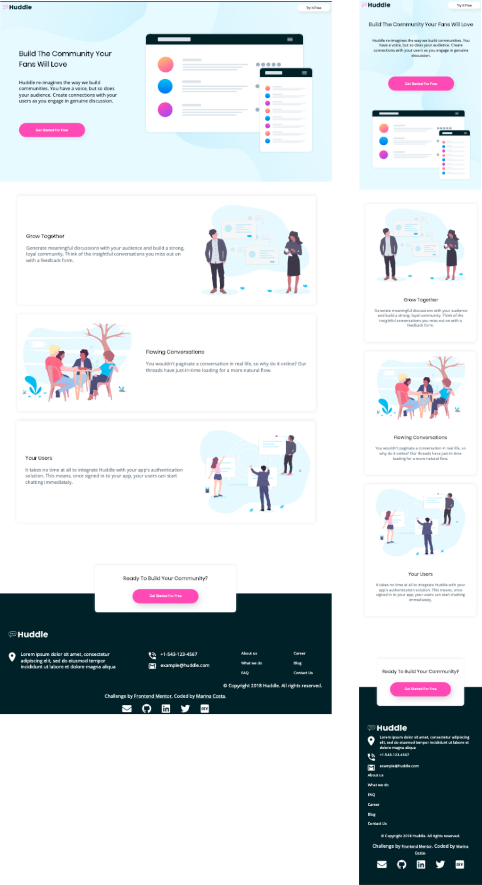

<h1 align="center">Frontend Mentor - Huddle landing page with alternating feature blocks</h1>

- I created this landing page based on the [Frontend Mentor - Huddle landing page with alternating feature blocks](https://www.frontendmentor.io/challenges/huddle-landing-page-with-alternating-feature-blocks-5ca5f5981e82137ec91a5100) design.

## Overview

- Here you can preview the results for mobile and desktop:

## Goals

- The challenge was to build out this page and make it look as close to the design as possible.
- The designs were in JPG static format. Meaning that I had to use my best judgment for styles such as `font-size`, `padding` and `margin`. 

## How to use it

- Download the files and open `index.html` on the browser.

## References and resources

* [Frontend Mentor](https://www.frontendmentor.io/challenges/huddle-landing-page-with-alternating-feature-blocks-5ca5f5981e82137ec91a5100)
* [MDN Documentation](https://developer.mozilla.org/en-US/)

